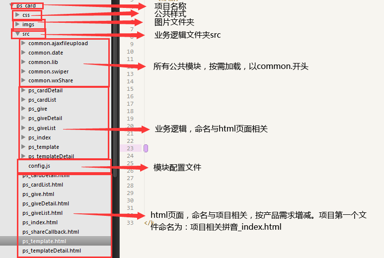
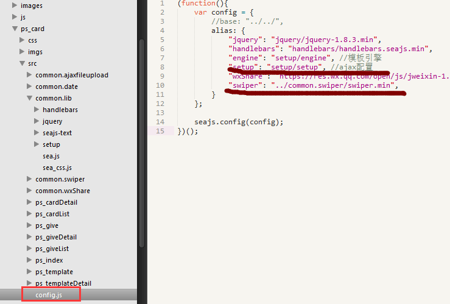
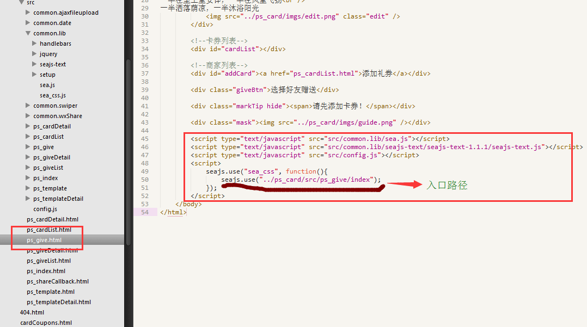
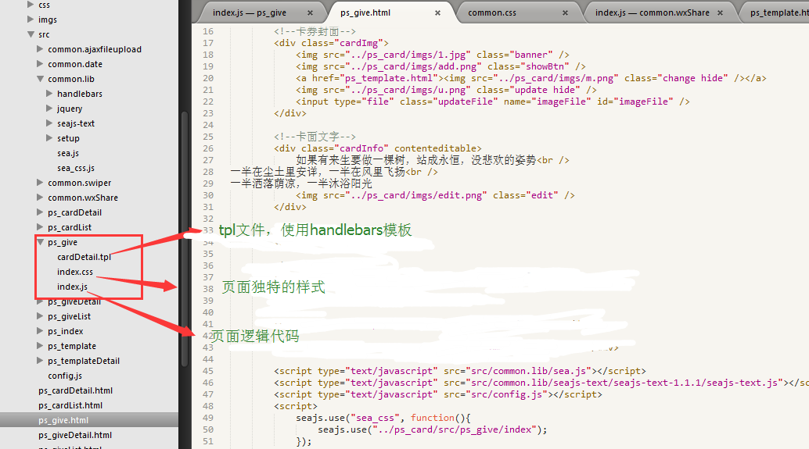
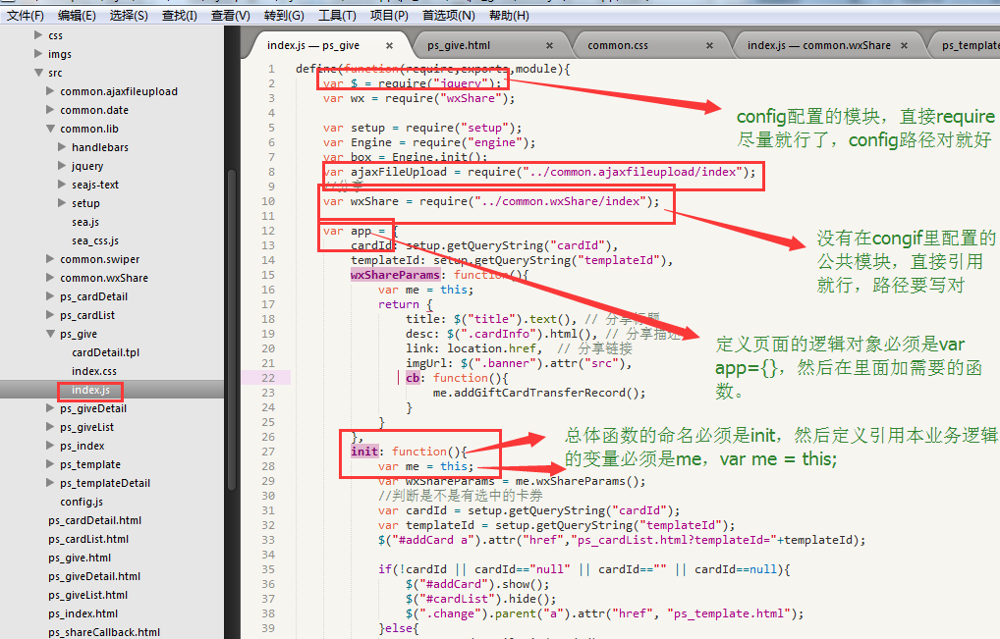
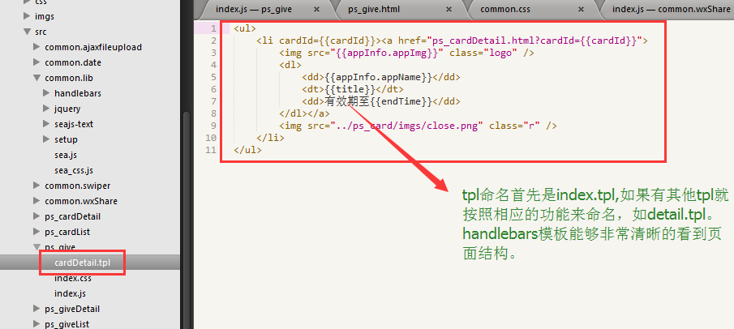
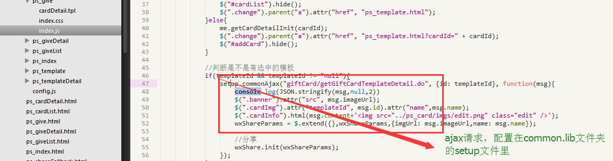
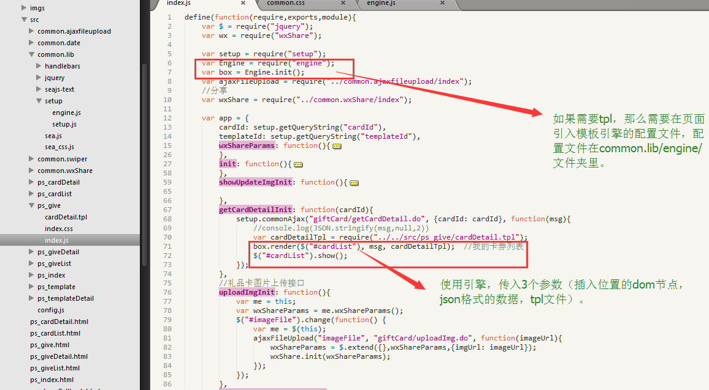
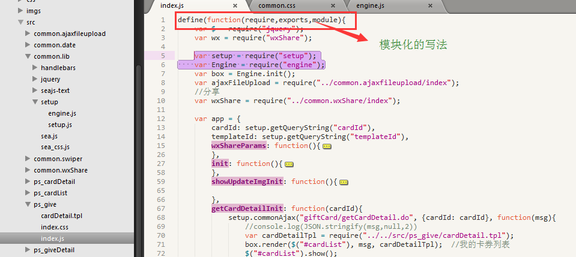

# 介绍

我们的框架是seajs+handlebars模块化开发。适合WAP和PC。我们的宗旨是把小项目的文件夹复制到任何地方都可以执行。

Seajs可以百度它的定义，以及用法，主要学习路径的配置。

Handlebars学习网站：[http://www.cnblogs.com/iyangyuan/archive/2013/12/12/3471227.html](http://www.cnblogs.com/iyangyuan/archive/2013/12/12/3471227.html)。

# 使用方法

1. 目前我们项目的文件结构为:

	

2. Seajs文件放在common.lib文件夹里，默认路径都是从seajs所在路径开始的。具体百度seajs。

	

3. 页面引入seajs

	

4. 单个模块的文件夹

	

	index.js文件，每个模块的入口文件必须命名为index.js。

	

	tpl文件，主页面的tpl必须命名为index.tpl。语法是hanlebars语法，用法直接找hanlebars的使用方法。

	

5. common.lib/setup里已经配置了setup.js文件，主要是配置了ajax，方便项目统一配置返回码，成功、失败函数。如果有需要，在index.js里var setup = require("setup");就可以在自己的页面上使用ajax了。例子：
	
	

6. common.lib/setup里已经配置了engine.js文件，主要是配置了tpl模板引擎的，如果有需要，在index.js里var setup = require("setup"); var Engine = require("engine");就可以在自己的页面上使用tpl了。例子：

	

7. 每个JS文件都要写成模块化的方式。如：

	

8. 压缩包demo.rar是项目demo，把它复制到你需要的文件夹下，开启项目。项目名称，多余的html文件、模块文件夹要删掉，改成自己项目需要的。
